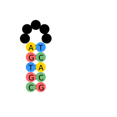
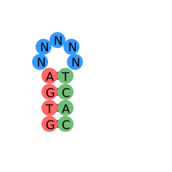
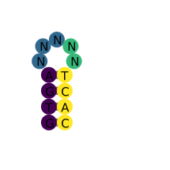
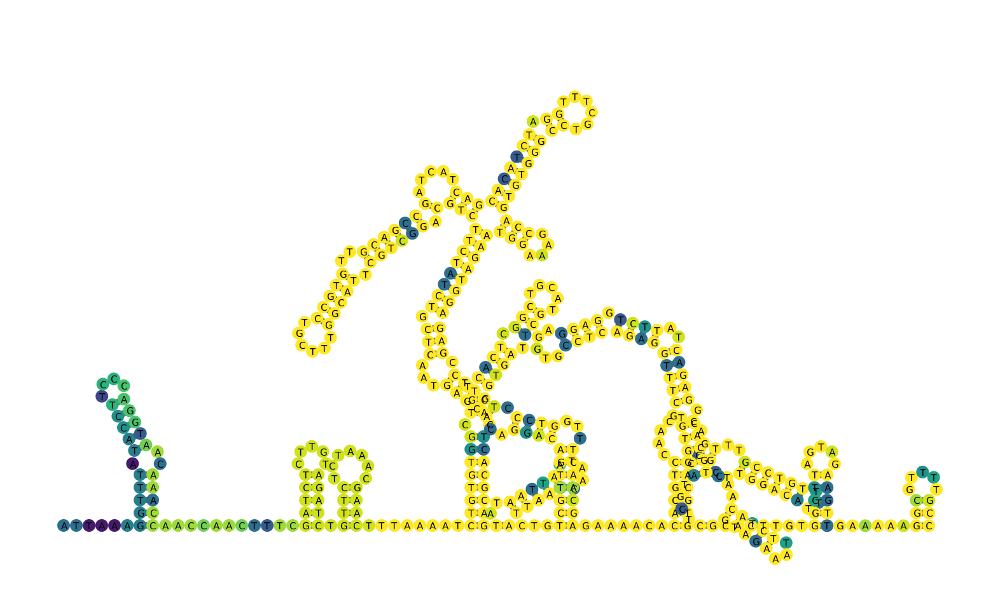
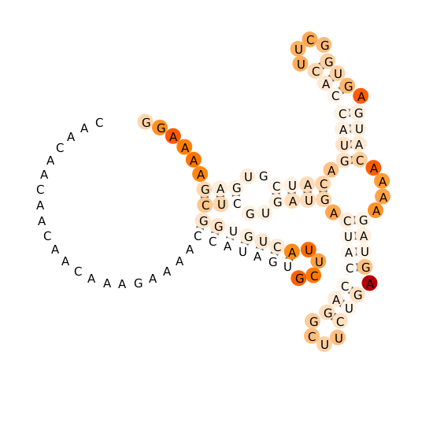

# draw_rna

Generate quick secondary structures of nucleic acids via jupyter notebook or command line.

A communal and continuing effort by the Das Lab, Eterna Players, M. Wu, H. Wayment-Steele.

## Dependencies

The default behavior is to output the secondary structure visualization to both svg and png. The png requires Inkscape, whose directory must be set by environmental variable `INKSCAPEDIR`.

## Basic Usage

### Jupyter notebook

See `example_files/demo.ipynb` for more. In brief:

```

```

### Input file

An input file is used to specify the sequence, secondary structure, and coloring of the desired drawing. The format is as follows

```
filename      # image will be written to filename.svg
GTGANNNNNTCAC # nucleic acid sequence
((((.....)))) # nucleic acid secondary structure in dot-bracket notation
rrrrbbbbbgggg # optional: coloring of each base (e.g. r for red, g for green, b for blue)
```

Multiple sequences can be specified in one file as in `example_input.txt`.

### Execution

The draw script can be run with

```
python draw_rna/draw_all.py example_files/example_input.txt
```

### Sample secondary structure diagrams:

  

## Notes on usage

## Multistrand drawing

At the moment, current practice is to include blanks between strands such as:
```
filename     
GTGANN NNTCAC
((((.....))))
rrrrbbwbbgggg
```
And then remove nucleotides corresponding to blanks afterwards. (This would be a quick fix.)

## NOTE ON render_rna and render_rna_flip:

'render_rna_flip.py' is what is currently called in the main routine and where major edits have been made. `render_rna.py` renders 3' -> 5'. TODO: handle 3' -> 5' drawing better.

## Extended options

### Draw a large thing with linear exterior loop and with a custom color vector:

`python draw_all.py covid19_5primeUTR.txt --large_mode --color_values perc_conserved_5UTR.txt --png`

If you use `--color_values` with an input file with multiple structures, the same colors will be applied to all the structures.



### Draw from RDAT file containing reactivity

Requires RDATkit to be in working python path. Example command:

`python draw_from_rdat.py ETERNA_R69_0000.rdat 297 --png`



### Movie mode

More coming eventually. For now, if you generate a bunch of stills, say from a cotranscriptional simulation, can string them together with ImageMagick:

`convert -delay 25 my_stills_*.png my_great_trajectory.gif`
